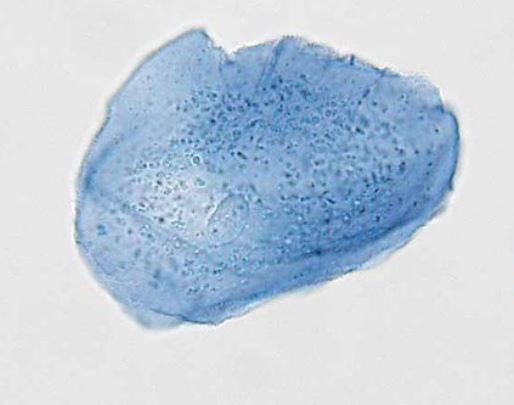
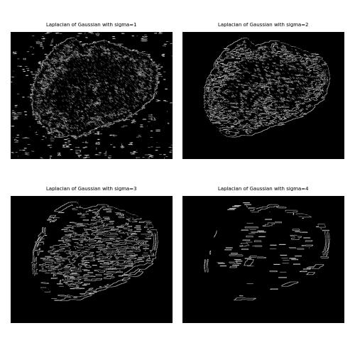
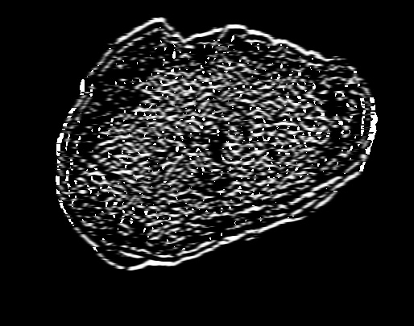
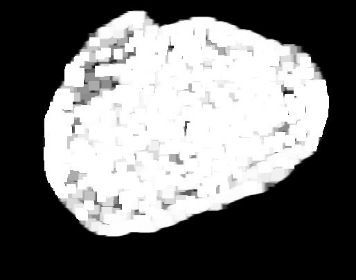
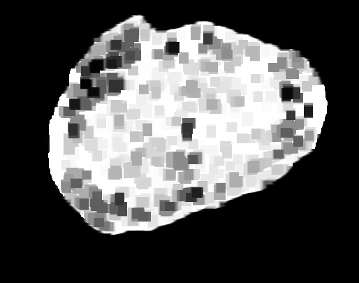
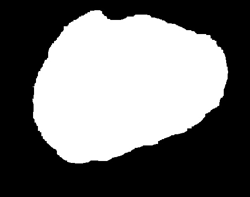
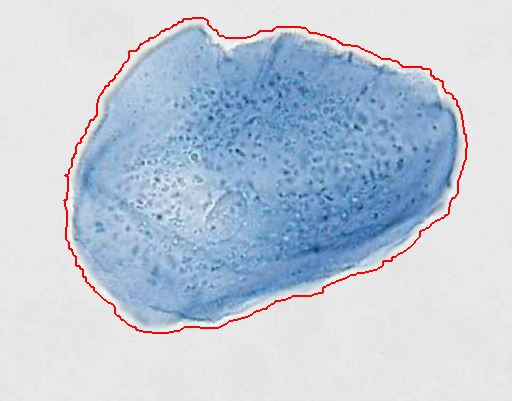

# Cell Segmentation
Cell Segmentation of a human cheek cell using Laplacian of Gaussian edge detection, morphological operators, and skimage's segmentation library.
## Starting Image (Human Cheek Cell)
<br>
## Laplacian of Gaussian Edge Detection
```
def any_neighbor_zero(img, i, j):
    for k in range(-1, 2):
        for l in range(-1, 2):
            if img[i + k, j + k] == 0:
                return True
    return False

def zero_crossing(img):
    img[img > 0] = 1
    img[img < 0] = 0
    out_img = np.zeros(img.shape)
    for i in range(1, img.shape[0] - 1):
        for j in range(1, img.shape[1] - 1):
            if img[i, j] > 0 and any_neighbor_zero(img, i, j):
                out_img[i, j] = 255
    return out_img
    
# display LoG edge detection with sigma values of 1-4
for sigma in range(1, 5):
    plt.subplot(2, 2, sigma)
    result = ndimage.gaussian_laplace(img, sigma=sigma)
    plt.imshow(zero_crossing(result))
    plt.axis('off')
    plt.title('Laplacian of Gaussian with sigma=' + str(sigma), size=5)
plt.tight_layout()
plt.savefig('LoG_sigma_range.jpg')
plt.show()
```
<br>
A sigma value of 2 is found to reduce all outside whilst keeping edges mostly intact.
# Dilation of Cell
After LoG edge detection was applied, the resulting image has gaps in it's outside edge. To fix this, the image is dilated twice using a kernel size of (7,7). All gaps in the outside edge have been filled in.
```
kernel = np.ones((7, 7), np.uint8)
dilation = cv2.dilate(img_edge, kernel, iterations=2)
```

<br>
# Erosion of Cell
Because dilation increased the white region of the image, the cell size also increased. To reduce the cell size back to the original size, erosion is performed twice with the same kernel. 
The previous two steps can be accomplished by simply applying a closing operator.
```
erosion = cv2.erode(dilation, kernel, iterations=2)
```

<br>
# Convert Gray Values to White
Skimage's segmentation.mark_boundaries() will be used to find the outside of the cell. If this is performed right away, the resulting image will have boundaries drawn all over inside the cell. To solve this, binary thresholding is applied. Any pixel value greater than 0 (black) is converted to 255 (white). 
```
(thresh, segmented_cell) = cv2.threshold(erosion, 1, 255, cv2.THRESH_BINARY)
```
<br>
# Mark Segmentation Boundary On Original Image
Now finally skimage's segmentation.mark_boundaries() can be applied to overlay the outside of the segmented image onto the original image of the human cheek cell.
```
segmentation_boundary = segmentation.mark_boundaries(img_original, segmented_cell, mode='thick', color=(0, 0, 255))
```
<br>
